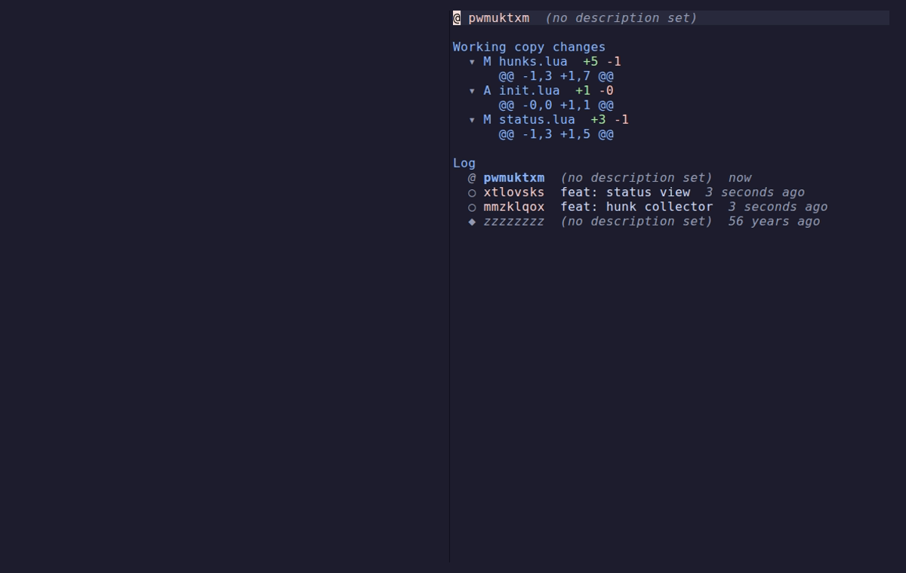
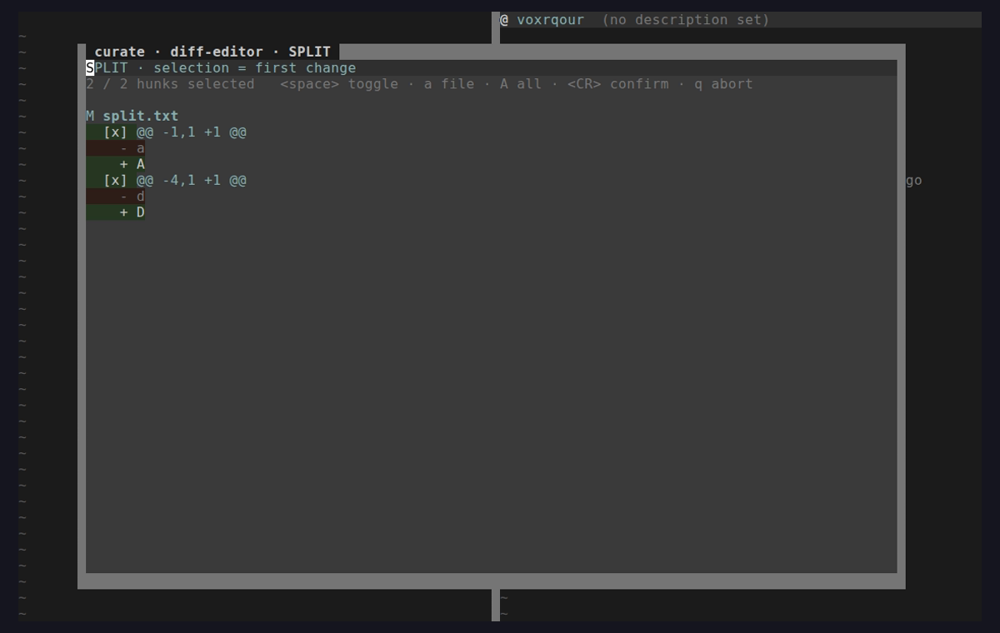
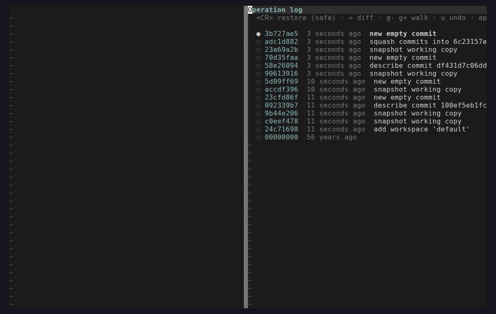
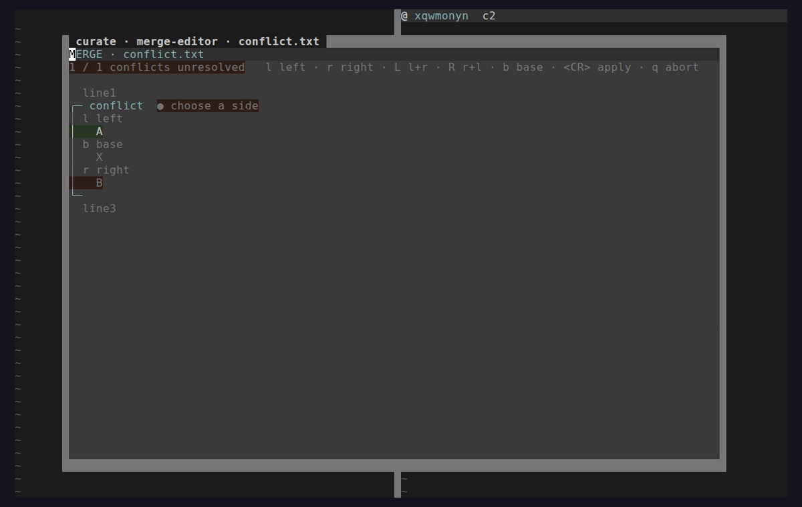
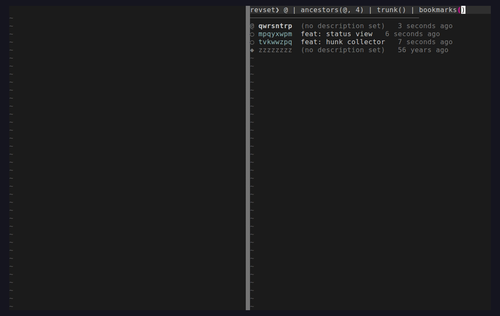

# curate.nvim

> jj's working copy is already a commit; **curate** is the one tool for turning it into the commit you meant.

A focused [Jujutsu (jj)](https://github.com/jj-vcs/jj) frontend for Neovim. Not a do-everything porcelain — curate goes 100% on one loop: **moving changes into the right commit**, with a native hunk-level diff-editor as the hero. It is the implementation of the [`curate.nvim` Lua Architecture](../project/curate.nvim%20Lua%20Architecture.dc.html) and [v1 Spec](../project/curate.nvim%20v1%20Spec.dc.html) design documents.

The four-verb loop:

| | verb | does | commands |
|---|---|---|---|
| **SEE** | the working diff | status home + log | `status` `log` |
| **ROUTE ★** | every hunk to its home | absorb · squash · **split via the native diff-editor** | `absorb` `squash` `split -i` `diffedit` |
| **NAME** | the change | describe · commit · new | `describe` `commit` `new` |
| **TRUST** | the moves | op-log time machine + undo | `op log` `undo` `op restore` |

ROUTE is the expertise: curate registers itself as jj's `ui.diff-editor`, so `split -i` / `squash -i` / `diffedit` open a **native nvim hunk-selection buffer** — no git-shim, no floating terminal.

## Screenshots

The status home, the diff-editor (split mode), the op-log time machine, the 3-way merge-editor, and the revset workbench — all captured automatically from the real plugin via [VHS](https://github.com/charmbracelet/vhs):







## Requirements

- Neovim **0.11+** (developed against 0.12)
- [`jj`](https://github.com/jj-vcs/jj) **0.42+** on `PATH`
- That's it. `which-key.nvim` is used if present; nothing else is required.

## Install

With [lazy.nvim](https://github.com/folke/lazy.nvim):

```lua
{
  "you/curate.nvim",
  config = function()
    require("curate").setup()
  end,
}
```

Then `:Curate` (or `:Curate status`) opens the home. Run `:checkhealth curate` to verify jj, the RPC server, and the diff-editor shim.

## Keymap (the contract)

Lower-case = safe · **UPPER-case = rewrites history**. `.` repeats the last rewriting gesture; counts apply.

### Home / log buffer

| key | action | jj |
|---|---|---|
| `<CR>` | edit / expand under cursor | `jj edit` / fold |
| `<Tab>` | cycle fold (file → hunks) | — |
| `n` | new change | `jj new` |
| `d` | describe | `jj describe` |
| `c` | commit (describe + new) | `jj commit` |
| `A` | **absorb working copy** | `jj absorb` |
| `s` | **squash into parent / mark** | `jj squash` |
| `S` | **squash interactively (hunks)** | `jj squash -i` |
| `x` | **split interactively (hunks)** | `jj split -i` |
| `=` | **restore hunk/file from parent** | `jj restore` |
| `m` `r` | mark · **rebase transient** (onto / -r / -b / insert ±) | `jj rebase` |
| `R` | **resolve conflicts (3-way merge-editor)** | `jj resolve` |
| `b` | bookmark menu (set/tug/delete/forget/track/list) | `jj bookmark …` |
| `f` | sync menu (fetch / fetch-all / push / push-change) | `jj git fetch/push` |
| `e` | revset workbench (live query) | `jj log -r …` |
| `Z` | power menu (duplicate/parallelize/fix/annotate/workspace) | `jj duplicate …` |
| `o` | op-log | `jj op log` |
| `u` | undo | `jj undo` |
| `L` | evolog of change | `jj evolog` |
| `g` `$` `?` | refresh · process log · cheatsheet | — |

### Diff-editor buffer

`<space>` toggle hunk · `a` toggle file · `A` toggle all · `[c` `]c` nav · `<CR>` confirm (write & exit 0) · `q` abort (jj cancels).

### Merge-editor buffer (3-way)

`l` take left · `r` take right · `L` left+right · `R` right+left · `b` base · `[c` `]c` nav conflicts · `<CR>` apply (write `$output`, exit 0) · `q` abort. Applies only when every conflict has a choice.

### Op-log buffer

`<CR>` restore to op (append-only) · `=` diff this op · `g-` `g+` undo/redo walk · `L` evolog · `u` undo.

### Revset workbench

Line 1 is an editable revset; the matching log recomputes live below as you type. `<CR>` on a result jumps to it (`jj edit`) · `q` close.

### Annotate / blame

A narrow gutter (change-id + age per line) scroll-bound to the source. `<CR>` jumps to the change that wrote the line · `q` close.

## The wedge: how curate becomes jj's diff- *and* merge-editor

When you press `x` (split) or `S` (squash-i), curate launches jj with itself registered as the diff-editor:

```
jj split -i -r <change>
  --config ui.diff-editor=curate
  --config merge-tools.curate.program=<curate-diff-shim>
  --config merge-tools.curate.edit-args=["$left","$right"]
```

1. jj materialises `$left` (before) and `$right` (after, writable), runs the shim, and **blocks**.
2. The `curate-diff-shim` (a ~40-line POSIX script — the nvr-style wait client) connects to the running nvim over `$CURATE_SERVER` and asks it to open the hunk buffer on `$left`/`$right`, then parks polling a result file.
3. You toggle hunks. On `<CR>` curate reconstructs each `$right` file from **only the selected hunks** and writes it back; on `q` it signals abort.
4. The shim reads the exit code and returns it to jj, which records the diff (or cancels).

No temp git repo, no `intent-to-add` dance. See `lua/curate/diffeditor/` and `bin/curate-diff-shim`.

`R` (resolve) reuses the **same handshake** as jj's `ui.merge-editor`: jj passes four files (`$base`/`$left`/`$right` read-only + an empty `$output`), the shim hands them to the running nvim, and the 3-way buffer writes the resolution into `$output`. One RPC mechanism, two editors.

## Architecture

Three layers plus the plugin shell (mirrors the design's module tree):

```
lua/curate/
  jj/         data layer — runner (vim.system argv), template parser, model, diff, revset
  ui/         mechanism  — View base, render (extmarks), tree, decor provider, transient
  views/      surfaces   — status, log, describe, diffeditor, mergeeditor, oplog, evolog,
                           revset, annotate, file, process
  actions/    the verbs  — route (absorb/squash/split/resolve), name, trust, reshape,
                           sync, power
  diffeditor/ engine     — hunks (2-way), merge3 (3-way), rpc + shim — the wedge
```

Data never knows about windows; views never shell out directly; everything mutating funnels through `actions/`. See [`../project/curate.nvim Lua Architecture.dc.html`](../project/curate.nvim%20Lua%20Architecture.dc.html).

## Development

The toolchain (Neovim, jj, busted, luacheck, stylua, VHS) is provisioned by [`../scripts/bootstrap-dev-env.sh`](../scripts/bootstrap-dev-env.sh) (idempotent; also wired as a SessionStart hook).

```sh
make test         # luacheck + busted (nlua, real vim API) + e2e diff-editor
make check        # stylua --check + luacheck
make format       # stylua write
make screenshots  # regenerate VHS captures
```

Tests run **inside Neovim's Lua runtime** via `nlua`, so `vim.system` / `vim.api` are live. The diff-editor end-to-end test needs a real RPC loop, so it runs as a standalone `nvim -l` script (`spec/e2e/`).

## Scope (drawn on purpose)

- **CORE (the experts):** absorb · squash/split hunk-routing · the status diff tree · describe/commit/new · op-log + undo.
- **SUPPORTING (ship it, don't innovate):** log home · a focused rebase gesture · bookmark · git push/fetch.
- **OUT (someone else's job in v1):** interactive rebase graph-surgery → jjui; revset IDE / forge / pickers → jj.nvim; gutter signs → vcsigns.

## License

MIT
